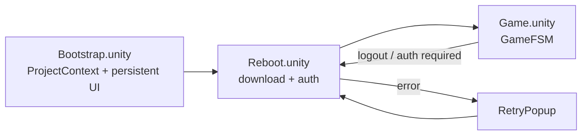
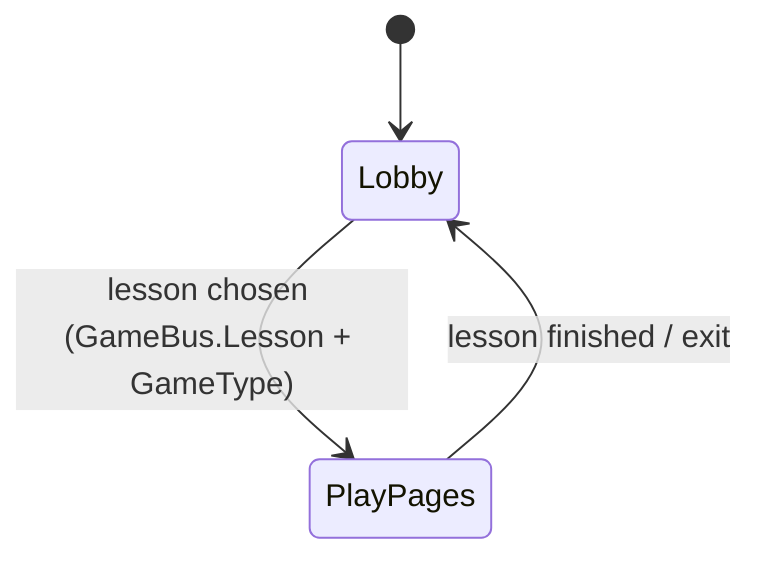

# Architecture

## Overview

- **Zenject** for dependency injection.
- **UniTask** for async code.
- Two finite state machines (FSMs) built on the in-house `DMZ.FSM` library:
  - `GameFSM` switches between the lobby and a lesson;
  - `PagesFSM` switches pages inside a lesson.
- The UI follows a **Controller + View** pattern: the controller is a plain C# class, the View is a `MonoBehaviour` in the scene.

All project scripts compile into `Assembly-CSharp`; the project has no `.asmdef` files of its own.

## Startup and scenes

Build order: `Bootstrap` (0), `Reboot`, `Game`. Scene name constants are in `Scripts/ProjectConstants.cs`.

| Scene | What it does |
|---|---|
| **Bootstrap** | The first `SceneContext` creates the `ProjectContext` (`Assets/Resources/ProjectContext.prefab`). PopupManager, LogIn, BuildVersion and SafeArea survive scene changes through `PersistentObject` (`DontDestroyOnLoad`). `Bootstrap.cs` loads Reboot right away. |
| **Reboot** | `Reboot.LoadingSequenceAsync` shows the loading UI, downloads the `Base` label (`AddressablesDownloader.PreloadAtGameStartAsync`), calls `AuthorizationService.AuthenticateAsync()` and loads Game. On an error it shows a `RetryPopup`. |
| **Game** | `Game.cs` starts `GameFSM`. On logout or when re-authentication is required, it goes back to Reboot (the `_isRebooting` flag prevents a double reboot). |
| **UITest** | UI sandbox with no `SceneContext`. Not in the build. |

## Dependency injection (Zenject)

Installers live in `Scripts/Game/Installers/`. Every binding is `AsSingle`. SignalBus and factories are not used.

| Installer | Context | Binds |
|---|---|---|
| `ProjectInstaller` | ProjectContext (lives for the whole app) | `ErrorHandler`, `EditorRestartTrigger` (Editor only), `MainScreenBus`, `AddressablesAssetManager` (as `IResourcesManager`), `AddressablesDownloader`, `PlayerProfile`, `AuthorizationService`, `ProfileService`, `LocalizationService`, `LanguagesConfig`, `PopupManager` (found in the scene), LogIn MVC |
| `BootstrapInstaller` | Bootstrap | `Bootstrap` |
| `RebootInstaller` | Reboot | `Reboot` |
| `GameInstaller` | Game | `Game`, `GameFSM`, `GameBus`, `RepetitionService`, `RepetitionLessonBuilder`, `SectionSortService`, `WordPathHelper`, `ScreenManager`, `RepetitionConfig`, every View (as `[SerializeField]` scene references) and every screen controller |

**FSM states are not bound in the container.** They are created with `new`, and their dependencies are injected by `DiContainer.Inject(state)` into `[Inject]` fields.

## State machines

### DMZ.FSM library (`Scripts/Game/FSM/DMZ.FSM`)

- `IState<T>`: `Type`, `Enter()`, `Exit()`.
- `IResultState<T>`: the state reports the next state through the `OnStateResult` callback. `FSMResultBase<T>` is built on this.
- `IUpdateState<T>`: the next state is returned from `Update()`. `FSMUpdateBase<T>` is built on this.
- `ResultStateBase<TState, TBus>`: base for states that share a data `Bus`.
- Usage examples are in `DMZ.FSM/Example`.

### GameFSM (`FSM/GameFSM.cs`)

- **`LobbyState`**:
  1. loads the profile (`ProfileService.LoadStoredData`) and applies the UI language;
  2. loads four configs from Addressables in parallel: VocabularyBook, Vocabulary, SentencesBook and Sentences;
  3. converts them to the `Chang.Core` model with `GoogleSheetsToCore` and stores them in `GameBus`;
  4. shows the lobby.
- **`PagesState`** runs a lesson:
  1. creates `PagesContentProvider`;
  2. prepares sentence questions (`InitSentenceQuest`);
  3. preloads the lesson's images and sounds;
  4. subscribes to the overlay buttons (Check, Continue, Return, Hint) and drives `PagesFSM`.

### PagesFSM (`FSM/PagesFSM.cs`)

States are keyed by the `ChangTypes` enum (`Scripts/ProjectEnums.cs`). Pages don't switch themselves: `PagesState` switches them from outside with `SwitchState(type)`.

| State | Page |
|---|---|
| `DemonstrationState` | Introduces a new word: word, image, sound |
| `SelectWordState` | Pick the correct word among several options |
| `MatchWordsState` | Match two columns |
| `SentenceSelectWordState` | Build a sentence from words |
| `PlayResultState` | Lesson results (`PagesBus.LessonLog`) |

How questions are queued and how marks change is described in [learning-logic.md](learning-logic.md#lesson-flow).

## Domain model

- **`Scripts/Game/Core`** (namespace `Chang.Core`) is the runtime model:
  - `Lesson` with its question queue;
  - the questions `QuestSelectWord`, `QuestMatchWords` and `SentenceSelectWords`;
  - `Word`, `Sentence`/`SentenceWord`;
  - books and sections.
- **`Scripts/Google`** (namespace `Chang.GoogleSheets`) holds the ScriptableObject classes in the shape they are imported from the sheets.
- **`Core/Bridge/GoogleSheetsToCore.cs`** is a static mapper from the imported data to Core.

## UI

**Controller + View** pattern:

- `*Controller` is a C# class from DI. It often implements `IViewController` (`SetViewActive(bool)`, `IDisposable`).
- `*View` is a `MonoBehaviour` in the scene. Its `Init(callbacks...)` method wires buttons to `Action` callbacks.
- Screens are placed in `Game.unity` in advance and opened by enabling their GameObject. Screens are not instantiated.
- Only popups and the loading screen have models (`*PopupModel`, `LoadingUiModel`).

| Screen | Controller / View |
|---|---|
| Main screen with tabs (Vocabulary, Sentences, Repetition, Profile) | `LobbyController` / `MainUiView` |
| Word / sentence book | `VocabularyController` / `BookVocabularyView`, `SentencesController` / `BookSentencesView` |
| Repetition | `RepetitionController` / `RepetitionView` |
| Profile | `ProfileController` / `ProfileView` |
| Lesson overlay (Check, Continue, Hint, Return) | `GameOverlayController` / `GameOverlayView` |
| Lesson pages | `*Controller` / `*View` in `Scripts/Game/Pages/*` |
| Loading | `LoadingUiController` / `LoadingUiView` (through `PopupManager.ShowLoadingUi`) |

**Popups.** `PopupManager` is a persistent `MonoBehaviour`. Its `Show*Popup(model)` methods build a popup from `IPopupElement` parts (header, label, button, input field, selector) and push it onto a stack.

## Data exchange

- **Buses** are shared data holders:
  - `MainScreenBus` at project level;
  - `GameBus` for the Game scene;
  - `PagesBus` for one lesson.
- **`DMZState<T>`** (`Scripts/Game/DMZState.cs`) is an observable value with `Subscribe`/`Unsubscribe`, `SetSilent` and `SetAndForceNotify`.
- Plain C# events and `Action` callbacks.
- UniRx, R3 and Zenject signals are not used.

## Async

- UniTask everywhere. Methods are named `*Async` and take a `CancellationToken`.
- Each state and controller owns its `CancellationTokenSource` and cancels it in `Exit`/`Dispose`.
- Fire-and-forget: `UniTaskVoid` + `.Forget()`.
- Parallel loading: `UniTask.WhenAll`.

## Logging and errors

- `DMZ.DebugSystem.DMZLogger` (`Scripts/Game/DMZLogger.cs`) is imported in each file through the alias `using Debug = DMZ.DebugSystem.DMZLogger;`.
- It has a WebGL-specific format and optional file logging (`persistentDataPath/Logs`).
- `ErrorHandler` logs an error and shows it in a popup. Repeated errors are merged.
