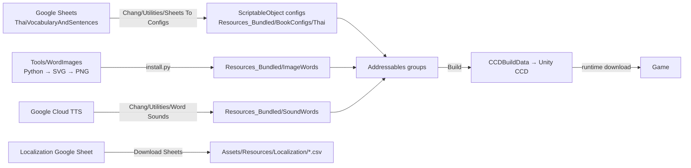

# Content Pipeline

## Source of truth: Google Sheets

All learning content (words, sentences, books and lessons) is edited **only in Google Sheets** and imported into Unity. Don't edit the imported assets by hand: the next import overwrites them.

### Sheet structure

- `BookInfo!B1` is the book language.
- In each sheet, `A1:B3` holds the language (B1), the type (B2: `Vocabulary`, `Sentences`, `VocabularyBook` or `SentencesBook`) and the section (B3).
- Sheet title suffixes: `.V` vocabulary, `.S` sentences, `.VB` / `.SB` books. A suffix that doesn't match the sheet type only produces a warning.

| Sheet type | Range | Format |
|---|---|---|
| Vocabulary | `B6:I` | One row per word: WordKey, ImageKey, SoundKey, Key, LearnWord, Phonetics, DefaultTranslation, DefaultDescription |
| Sentences | `C5:O` | 9-row blocks per sentence. Rows 0–4: Key, SentenceKey, ImageKey, SoundKey, DefaultTranslation. Row 5: DisplayIndex per word. Row 6: M/R/G modifiers. Row 8: word keys (up to 9) |
| VocabularyBook / SentencesBook | `A4:C` | `Section` in column A starts a section, a non-empty column B starts a lesson, column C holds a key |

A sentence translation uses `{0}`, `{1}`… placeholders where the Replaceable words go, e.g. "I want to buy {0}". See [learning-logic.md](learning-logic.md#sentences).

### Import

1. **Chang/Utilities/Sheets To Configs** selects `Assets/Project/Configs/RootSheetsToConfig.asset`.
2. The **CreateAllConfigs** button imports Vocabulary → VocabularyBook → Sentences → SentencesBook. Each step also has its own button.
3. The output goes to `Assets/Project/Resources_Bundled/BookConfigs/Thai/`: `Vocabulary.asset`, `Sentences.asset`, `VocabularyBook.asset`, `SentencesBook.asset`.

The sheets are read through a Google service account (read-only). The key and the spreadsheet id are in the `ChangExternal` submodule. Import code: `Scripts/Utilities/Editor/GoogleSheets/`.

## Keys

Keys are path-like: `{Language}/{Type}/{Section}/{Key}`.

- Word: `Thai/Vocabulary/Food/Fried rice`
- Sentence: `Thai/Sentences/Food Market/Do not add sugar`
- Section: `Thai/VocabularyBook/Food`

`WordKey` and `SentenceKey` are also the localization keys.

> **Rule.** The last part of a key may contain only Latin letters, digits and spaces. Brackets, commas, apostrophes, question marks, slashes, hyphens and any other punctuation become `_`.
> Otherwise those characters end up in file names and Addressables addresses.

## Word images

- Path: `Assets/Project/Resources_Bundled/ImageWords/Thai/<Section>/<Key>.png`.
- Generators: `Tools/WordImages` (Python). The style is described in `Tools/WordImages/STYLE.md`.
  1. `generate.py` generates SVGs;
  2. `render.py` renders PNGs and a contact sheet (needs `cairosvg`, `Pillow` and brew `cairo`);
  3. `install.py` copies the PNGs into the project, keeps the GUIDs in existing `.meta` files and registers new folders in the `Remote_Thai_Image_Words` group.

## Word sounds

- Path: `Assets/Project/Resources_Bundled/SoundWords/Thai/<Section>/<Key>.mp3`.
- Generation: **Chang/Utilities/Word Sounds/Generate Missing Sounds** uses Google Cloud TTS with the `th-TH-Chirp3-HD-Aoede` voice. It only generates sounds for words that don't have one yet. **Log Missing Sounds** only lists those words.

> **Rule.** Word sounds must have no silence at the start or end: sentence audio is assembled from individual words.
> Format: mp3, 24 kHz, mono, 32 kbps. ffmpeg filter for trimming silence:
> `silenceremove=start_periods=1:start_threshold=-40dB:start_silence=0.02:detection=rms:window=0.02,areverse,` (repeat), then `areverse`.
> The old Google recordings have a noise floor around −50 dB, so a −50 dB threshold won't trim them.

## Addressables and Unity CCD

Content is downloaded from **Unity Cloud Content Delivery**: environment `dev`, badge `latest`. Settings: `Assets/AddressableAssetsData/`.

| Group | Contents | Packing | Label |
|---|---|---|---|
| `Remote_Thai_Book` | the 4 book configs | together | `Base` (downloaded at startup) |
| `Remote_Thai_Image_Words` | `ImageWords/Thai/*` folders | by label | — |
| `Remote_Thai_Sound_Words` | `SoundWords/Thai/*` folders | separately | — |

- An asset's address is its full path. `WordPathHelper` builds the image and sound paths from a word key by removing `Vocabulary/`, giving e.g. `SoundWords/Thai/<Section>/<Key>.mp3`.
- The `Base` label is downloaded in the Reboot scene.
- `PagesContentProvider` downloads the lesson's images and sounds before the lesson starts and shows the progress in bytes.
- Built bundles are kept in the `CCDBuildData` submodule (`DeMoZ/ChangBundlesBuilds`).
- In the Editor, **Chang/Content/Addressables/Addressables Resources Window** clears the bundle and catalog cache.

## Editor menus

| Menu | Purpose |
|---|---|
| Chang/Utilities/Sheets To Configs | Import content from Google Sheets |
| Chang/Utilities/Word Sounds/Log Missing Sounds | List words without a sound |
| Chang/Utilities/Word Sounds/Generate Missing Sounds | Generate the missing sounds |
| Chang/Utilities/Localization/Create Sheet View | Create a localization CSV viewer asset |
| Chang/Content/Addressables/Addressables Resources Window | Cache, catalogs, empty label check |
