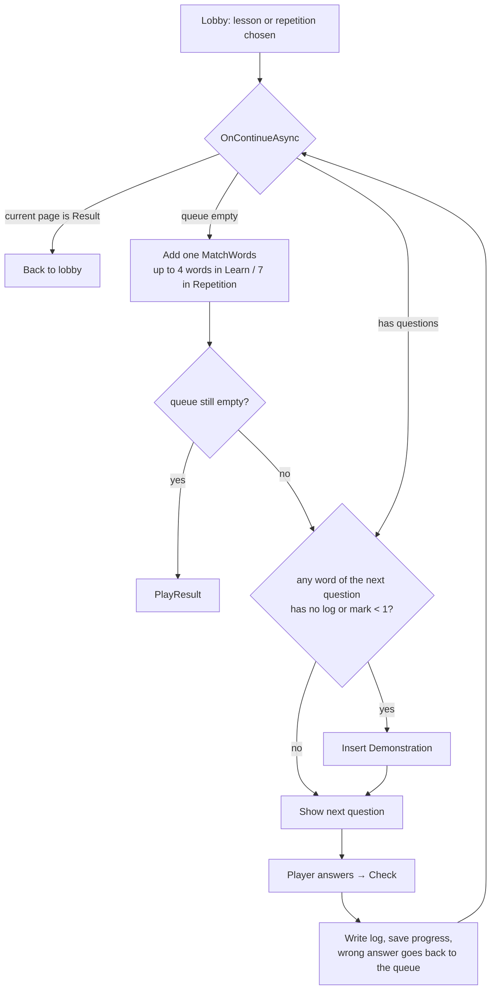

# Learning Logic

## Mark

Every word and every sentence has its own **mark** from 0 to 10. Marks are stored in the progress logs `VocabularyQuestLog` and `SentenceQuestLog` (`Scripts/Profile/`).

Constants are in `Scripts/ProjectConstants.cs`:

| Constant | Value | Meaning |
|---|---|---|
| `MARK_MIN` / `MARK_MAX` | 0 / 10 | Mark bounds |
| `MARK_INCREMENT` | +1 | For a correct answer without a hint |
| `MARK_DICREMENT` | −3 | For a wrong answer |
| `LOG_LIMIT` | 10 | How many recent answers a log keeps |

Besides the mark, a log stores `SuccessSequence` (correct answers in a row, reset on a mistake), `UtcTime` (time of the last answer) and a queue of recent answers.

### Where the mark changes

| Page | Correct | Wrong |
|---|---|---|
| Demonstration | +1 (always counts as correct) | — |
| SelectWord | +1, or 0 if a hint was used | −3; the question goes back to the end of the queue |
| MatchWords | 0 (matching never raises a mark) | −3 to both words of the wrong pair |
| SentenceSelectWord | +1 to the sentence mark; word marks don't change | −3 to the sentence mark; −3 to every misplaced word and to the word that should have been there; the question goes back to the queue |

Code: `PagesState.OnCheck*Async` → `ProfileService.AddVocabularyLog` / `AddSentenceLog`.

## Question type by mark (SelectWord)

Code: `Scripts/Game/WordHelper.cs`.

| Word mark | Question | Options |
|---|---|---|
| no log or < 1 | A **Demonstration** is inserted first | — |
| 0–2 | Thai | English |
| 3–4 | English | Thai |
| 5–10 | random direction | |

**Phonetics** (transliteration) are shown for a Thai word when *its own* mark is < 7. This is decided per word, including the wrong options.

**Hint** shows phonetics. On SelectWord it also blocks the mark increment.

## Sentences

A sentence is made of `SentenceWord` items. Each word has a `DisplayIndex` and `Modifier` flags.

- Words with `DisplayIndex <= sentence mark` are hidden and moved into the word mix. The higher the mark, the more words the player has to place.
- From mark 5 (`SENTENCE_MIX_WORDS_FILL_MIN_MARK`), the mix is padded with distractor words from the same section until it holds at least `mark` words.
- `Modifier` flags (`Game/Core/Sentence.cs`):
  - `Replaceable` (R): on each showing the word is swapped for a random word from the same vocabulary section. In the translation such a word is shown in **square brackets**, e.g. "I want to buy [rice]", because its grammatical form may not fit the sentence.
  - `Gender` (G): polite particles and pronouns are chosen by the gender in the profile.
  - `MixFiller` (M): the section's words are added as distractors.

Sentence preparation: `PagesState.InitSentenceQuest`.

## Lesson flow

- **Learn**: a lesson from a book. For words, `VocabularySection.PopulateQuestions` creates one `QuestSelectWord` per key, with the lesson's other keys as options. For sentences, `SentencesSection.PopulateQuestions` creates one `SentenceSelectWords` per key.
- **Repetition**: the lesson is built by `RepetitionLessonBuilder` (see below).
- `ProfileService.SaveProgressAsync` runs after every answer.

## Repetition (spaced repetition)

Code: `Scripts/Services/RepetitionService.cs`, `RepetitionLessonBuilder.cs`. Settings: `Assets/Project/Resources/RepetitionConfig.asset`.

A key's **priority** is *hours since the last answer* divided by *the interval for its mark*. The minimum interval is 1 minute. A key is **due** when its priority is ≥ 1.

| Mark | 0 | 1 | 2 | 3 | 4 | 5 | 6 | 7 | 8 | 9 | 10 |
|---|---|---|---|---|---|---|---|---|---|---|---|
| Interval, h | 0 | 4 | 12 | 24 | 48 | 96 | 168 | 336 | 720 | 1440 | 2880 |

Key selection:

1. Due keys first, then the rest.
2. Within each group, keys are picked at random, weighted by priority (clamped to 0.01–10), from the top `amount × poolMultiplier`.
3. A lesson has 10 items. A mixed lesson has 3–7 words; the rest are sentences.

Options for a word are picked in this order: played words of the lesson → played words of the section → all played words → unplayed words of the section. At most 5.

Entry points:

- the Words / Sentences / Mixed buttons on the Repetition tab;
- the per-section repeat button and the general repeat button in the books.

The Repetition tab shows the 30 most recently played items.

## Section sorting (the "S" button)

> Sorting is a **separate feature**; it is not repetition.

Each book section has an "S" button. It collects the word or sentence keys from the section's lessons, looks up their marks in the progress log, and redistributes the keys across the same lessons ordered by mark, highest first. Lesson sizes stay the same.

Code: `SectionSortService`. The result is kept in `PlayerProfile.Reordered*Sections` in memory only and is not saved.
