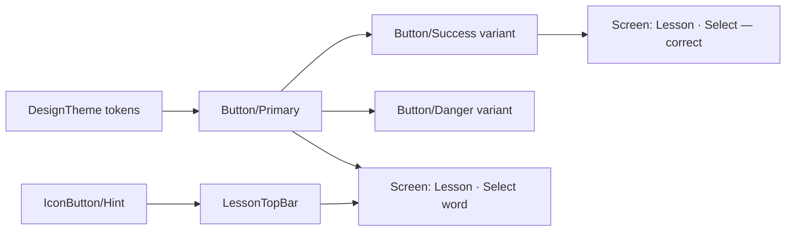

# UI design system (Penpot redesign)

The redesigned UI is generated from the Penpot file **"New File 1"**, pages `Redesign · Foundations`, `Redesign · Components`, `Redesign · Screens` and `Redesign · Mascot`.
Penpot is the source of truth for the look. Unity gets prefabs that keep Penpot's component structure, so a change in one place reaches every screen that uses it.

> Status: **step 3 of 3** — every screen, the login included, runs on the new UI; the data the design shows is connected except the parts in [Not connected yet](#not-connected-yet).
> The old UI prefabs stay in `Assets/Project/Prefabs` but are not in the scenes any more.

## Where things are

| What | Path |
|---|---|
| Theme (color and font tokens, editor-only) | `Assets/Project/UI/DesignTheme.asset` |
| Component prefabs | `Assets/Project/UI/Components/<Group>/<Name>.prefab` |
| Screen prefabs | `Assets/Project/UI/Screens/*.prefab` |
| Mascot presets | `Assets/Project/UI/Mascot/*.prefab` |
| Vector art (SVG → sprite) | `Assets/Project/UI/Vectors/{Icons,Art,Mascot,Strokes}` |
| Preview scene, every screen under a 540×1080 canvas | `Assets/Project/UI/DesignPreview.unity` |
| TMP fonts (Prompt, Noto Sans Thai Looped, Charmonman) | `Assets/Project/Fonts/Resources/Fonts & Materials` |
| Views: generated screens/components with the game's View scripts | `Assets/Project/UI/Views` (items in `Views/Items`, popup parts in `Views/Popup`) |
| Runtime scripts | `Assets/Project/Scripts/UI/DesignSystem` |
| Importer and views builder | `Assets/Project/Scripts/Editor/DesignSystem` |

## How the "constructor" works

Three layers, from smallest to biggest:

1. **Tokens.** `DesignTheme` holds named colors (the Penpot library: *Ink*, *Royal indigo*, *Rice paper*…, plus *White* and the tone colors) and fonts per family/weight (`Prompt/SemiBold`, `NotoSansThaiLooped/Medium`…).
   Graphics reference a token through `ThemeColor` (token + alpha); texts reference a font through `ThemeFont`.
   Change a token in the theme asset and every element using it updates in the Editor.
   The theme is editor-only: the resolved color and font are baked into the `Graphic`/`TMP_Text` of the prefab, so at runtime the theme is not loaded and not included in the build. `ThemeColor`/`ThemeFont` stay on the objects only as token markers.
2. **Components.** Every Penpot main component is a prefab. Within a group (`Button`, `IconButton`, `OptionCard`, `LessonNode`, `TabBar`…) the first component is the **base** and the others are **prefab variants** of it: `Button/Secondary`, `Ghost`, `Success`, `Danger` and `Primary Disabled` are variants of `Button/Primary`. A variant overrides what differs: colors, texts, sizes, extra layers (added objects) and missing layers (disabled objects).
   A component used inside another component is a **nested prefab** (e.g. `IconButton/Hint` inside `LessonTopBar`).
3. **Screens.** Screens contain nested instances of the components with overrides (texts, colors, visibility), just like instances in Penpot.

So editing `Button/Primary` (radius, height, label font) changes all buttons on all screens; editing a variant changes only that variant.



### Type scale

The design board is 540 units wide; a 6–6.1″ phone is about 393 pt wide, so 1 pt ≈ 1.37 design units.
Text sizes follow Apple HIG / Material minimums converted to design units:

| Role | Design units | ≈ pt on a 6″ phone |
|---|---|---|
| Caption, badge (smallest allowed) | 18 | 13 |
| Secondary text, labels | 20–21 | 15 |
| Phonetics, list rows | 22–23 | 16–17 |
| Body | 24 | 17.5 |
| Buttons, card titles | 26–28 | 19–20 |
| Screen titles | 30–38 | 22–28 |
| Large Thai words | 40–58 | 29–42 |

Don't use text smaller than 18 units. The lobby (section headers, lesson nodes, tab labels) is larger on purpose.

### Mapping Penpot → uGUI

| Penpot | Unity |
|---|---|
| Board with flex layout | `HorizontalLayoutGroup` / `VerticalLayoutGroup` (wrap → `FlowLayoutGroup`); `space-between` → `#spacer` children |
| Fixed / fill / auto sizing of a layout child | `LayoutElement` min/preferred size, flexible size, or the content's own size |
| Fill, radius | `#bg` child with `ProceduralImage` + `FreeModifier` |
| Drop shadow | `#shadow` child: blurred `ProceduralImage` (`FalloffDistance`) |
| Stroke | `#stroke` child: `ProceduralImage` with `BorderWidth`; dashed strokes are SVG sprites |
| Linear gradient | `Gradient2` effect |
| Text | `TextMeshProUGUI` + `ThemeFont` + `ThemeColor`; mixed styles become rich text tags; single-line texts in layouts get `LayoutNoShrink` so overflowing rows don't squeeze them |
| Icon, illustration, mascot (paths) | SVG file imported as a textured sprite; one-color icons are white and tinted by `ThemeColor` |
| Component instance | Nested prefab instance |

Children named `#…` are generated helpers. `DesignNode` keeps the Penpot shape id on every generated object.

Direct children of a screen are anchored to the nearest edge (top, bottom or stretched) so the 540×1080 design adapts to other aspect ratios. The phone `StatusBar` mock-up from the design is imported disabled.

## Updating the design

1. Open the Penpot file in the browser (logged in) and run this in the browser console. It saves the whole file as JSON:

   ```js
   const id = new URLSearchParams(location.hash.split('?')[1]).get('file-id');
   const r = await fetch(`/api/rpc/command/get-file?id=${id}`, { headers: { Accept: 'application/json' } });
   const a = document.createElement('a');
   a.href = URL.createObjectURL(await r.blob());
   a.download = 'chang-penpot.json';
   a.click();
   ```

   Keep the file in `Design/chang-penpot.json` at the repository root. `Design/*.json` is git-ignored: the export is ~35 MB and can always be taken again from Penpot.
2. In Unity: **Chang → Design System → Import from Penpot JSON…** and pick the file. **Re-import last Penpot JSON** repeats the last one.

The import updates prefabs in place: objects are matched by `DesignNode` id, so components and children added by hand (scripts, extra objects) survive, and shapes removed from the design are removed (or disabled inside nested prefabs). The preview scene is regenerated every time — don't put anything in it.

Rules for the Penpot file that keep the import clean:

- Reuse elements as **components**, not copies. Copies become separate objects; only components give the shared prefab. For example, the tab item inside `TabBar` and the chevron buttons inside `SectionHeader` are plain frames now.
- Keep variants of one component in one group (`Chang DS / Button / …`) with the same layer structure, so they become prefab variants.
- Use library colors. Other colors stay raw values and are not themeable.
- Name icons `icon / <name>`: they get stable file names in `Vectors/Icons`.

## Views: the game logic on the design

Generated prefabs (`Components`, `Screens`) are never edited by hand. The game uses **views**: prefab variants of them in `Assets/Project/UI/Views` with the existing View scripts (`BookVocabularyView`, `SelectWordView`, `CToggle`, `GameBookItem`…) attached and wired. A design re-import changes the look of the views; their scripts and references stay.

The views are built by **Chang → Design System → Build Views** (`DesignViewsBuilder`). It is repeatable: run it again after a re-import, or after changing the builder. Things the builder does to a design screen:

- hides the parts that the game draws elsewhere (the tab bar is one for all tabs in `MainUI`, the lesson top bar and Check button are in `GameOverlay`) and the sample content of lists;
- makes long screens scrollable (`ScrollRect` on the screen, content grows with `ContentSizeFitter`);
- puts runtime content in place of design placeholders (a sprite `Image` over the sample illustration);
- adds `Button`/`Toggle` to the design frames the user taps;
- hides parts that have no data yet (see below).

**Use Views In Scenes** (`DesignViewsSceneSetup`) put the views into `Game.unity` and `Bootstrap.unity` and rewired `GameInstaller` and `PopupManager`. It was a one-time step; the scenes reference the view prefabs, so rebuilding the views needs no scene changes. **Use Login View In Bootstrap** did the same for the login (`ProjectInstaller` finds the `LogInView` in the scene).

### Screen data

| Where | Shows | Source |
|---|---|---|
| Lesson top bar | progress | lesson questions answered correctly ÷ lesson questions (`PagesState`); demonstrations and the generated match words don't count |
| Section header | `62% · 6 lessons`, bar | mean lesson progress of the section (the book controllers) |
| Section header | title, Thai title | localization keys `Section.<Key>` and `Section.<Key>.Learn`; without them the raw key is shown and the Thai title is hidden |
| Lesson complete | Words · Mastery · Accuracy | from the lesson log: played word keys; mean mark of the played keys after the lesson ÷ max mark; correct answers ÷ answers |
| Repeat | Words · Sentences · Answers | played words and sentences; answers kept in their logs (the last `LOG_LIMIT` of each key, so not the all-time total) |
| Repeat due card | `18 words · 4 sentences`, `next batch in 4 h` | `RepetitionService.GetSummary`: due keys, time until the next not-due key becomes due (hidden when every key is due) |

### Login

`LoginView` (built by `BuildLogin`) carries `LogInView` of the `DMZ.Legacy.LoginScreen` submodule. The design draws only the first step (sign in with a name / continue as a guest); the name and password form and the signed-in panel (log out, delete account) are cards made of the design components: the Dialog card, TextField, the Segmented control (Log in / Sign up, painted after the toggles by `ToggleSelection`) and buttons. The validation and server messages are still the submodule's English texts.

### Texts

Design texts are localized with `LocalizedTMPText` and keys in the `Lobby` sheet (`Lobby.*`, `Lesson.*`, `Login.*`, `Section.*`). A key that is not in the sheet yet shows the English text from the builder or the design, so new keys can be added to the sheet later.

### Element states come from the design

Penpot draws element states as component variants. `DesignStates` switches an element between them at runtime: each state references its variant prefab and `Apply(state)` copies the look (colors, sprites, borders, opacity, visibility) from it. So a state changed in Penpot changes the game after a re-import, without code.

| Element | States (variants) | Switched by |
|---|---|---|
| Answer option (`Items/OptionToggle`) | OptionCard Default, Selected, Correct, Wrong | `CToggle` |
| Match tile (`Items/MatchToggle`) | MatchTile Default, Selected, Matched, Wrong | `CToggle` |
| Sentence chips (`Items/ChipToggle`, `ChipFixedToggle`) | WordChip Default, Placed / Fixed | `CToggle` |
| Lesson in the book (`Items/LessonItem`) | LessonNode New, Score 0…100pct | `GameBookItem.SetProgress` (mark sum of the lesson) |
| Section header (`Items/SectionHeader`) | SectionHeader Expanded, Collapsed | the chevron; collapsing hides the lessons |
| Tab bar (`MainUI`) | TabBar Words, Sentences, Repeat, Profile | `MainUiView` |
| Feedback sheet (`GameOverlay`) | FeedbackSheet Correct, Wrong | `PagesContinueView` |
| Result row (`Items/ResultRow`) | ResultRow Up, Down | `ResultItem` |

Groups without variants (Repeat mode segments, politeness options, mascot editor tabs and tiles) use `DesignSelection`: it takes the look of the item drawn as selected and of an item drawn as normal and paints the selection.
Helper layers (`#bg`, `#stroke`…) are matched by name and content layers by order, and a layer the look doesn't have is hidden — so the selected tab loses its outline and only the selected tile shows the check mark.

### Mascot

The mascot is drawn at runtime, not from the imported SVG sprites, because the player combines 9 parts × 20 options (`Scripts/Game/Mascot`):

- `MascotLook` (in `ProfileData`) is an option index per part (`MascotPart`: head colour, ears, eyes, tusks, tusk colour, forehead mark, blush, blush colour, hat).
- `MascotCatalog` holds the option names and colors; `MascotSvg` is a C# port of the generator the Penpot page "Redesign · Mascot" was drawn with, so the game draws exactly the design's options.
- `MascotRenderer` turns the SVG into a texture with Unity's built-in vector graphics module (tessellation → antialiased render texture → `Texture2D`, ~10–20 ms per picture). `MascotImage` shows it on a `RawImage` at the pixel size of its rect and renders again only when the look or the size changes, at most 3 pictures per frame.

To change the options, change the generator in Penpot and `MascotSvg`/`MascotCatalog` together.

**Mascot editor** (`MascotEditorController` / `MascotEditorView`) is built from the screen "Profile · Mascot — Hat" (the other tab screens only show other grids) and lives in `MainUI` over the tabs. The profile opens it with the pencil on the avatar or the "My mascot" row. Tabs switch the part (the row swipes sideways, `HorizontalDragScroll`), the grid shows 20 options of the part (color parts as swatches), the preview follows every change, Random rolls a full combination. Save writes the look to the profile (`ProfileService.SaveProfileDataAsync`), Back drops the changes. The profile header shows the saved mascot.

### Screen size

The new canvases are 540×1080 design units in *Expand* mode: the whole design always fits, a taller phone gets more height. On wide screens (landscape, tablets, WebGL) `WidthLimiter` keeps the column centered and at most 600 units wide.

### Not connected yet

The design shows these, the game has no data or logic for them yet (step 3). They are hidden or left static in the views:

- Streak chip, daily goal, "phrase of the day" (#86).
- Word detail sheet (#85), dialogues (#88), alphabet (#89), slow sound.
- The "Chang" chip in the mascot editor is static: the mascot is the player, it has no own name. Texts of the mascot editor are English · Thai from the design, without localization keys.
- The lesson number on the result screen ("Lesson complete" is shown).

## Fonts

Prompt (UI text), Noto Sans Thai Looped (Thai text, falls back to Prompt for Latin) and Charmonman (decor) are under the SIL Open Font License; the license files are next to the TTFs in `Assets/Project/Fonts`.
