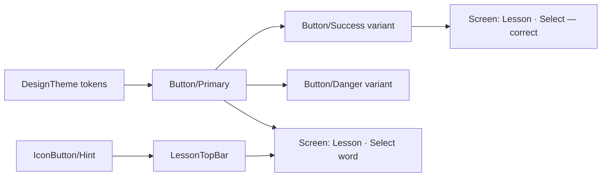

# UI design system (Penpot redesign)

The redesigned UI is generated from the Penpot file **"New File 1"**, pages `Redesign · Foundations`, `Redesign · Components`, `Redesign · Screens` and `Redesign · Mascot`.
Penpot is the source of truth for the look. Unity gets prefabs that keep Penpot's component structure, so a change in one place reaches every screen that uses it.

> Status: **step 1 of 3 — design only.** The new prefabs have no game logic yet.
> Step 2 connects the existing controllers/views to them; step 3 implements the logic that the design adds (mascot editor, dialogues, alphabet, word detail…).
> The old UI in `Assets/Project/Prefabs` still runs the game until step 2.

## Where things are

| What | Path |
|---|---|
| Theme (color and font tokens, editor-only) | `Assets/Project/UI/DesignTheme.asset` |
| Component prefabs | `Assets/Project/UI/Components/<Group>/<Name>.prefab` |
| Screen prefabs | `Assets/Project/UI/Screens/*.prefab` |
| Mascot presets | `Assets/Project/UI/Mascot/*.prefab` |
| Vector art (SVG → sprite) | `Assets/Project/UI/Vectors/{Icons,Art,Mascot,Strokes}` |
| Preview scene, every screen under a 540×1080 canvas | `Assets/Project/UI/DesignPreview.unity` |
| TMP fonts (Prompt, Noto Sans Thai Looped, Charmonman) | `Assets/Project/Fonts/Resources/Fonts & Materials` |
| Runtime scripts | `Assets/Project/Scripts/UI/DesignSystem` |
| Importer | `Assets/Project/Scripts/Editor/DesignSystem` |

## How the "constructor" works

Three layers, from smallest to biggest:

1. **Tokens.** `DesignTheme` holds named colors (the Penpot library: *Ink*, *Royal indigo*, *Rice paper*…, plus *White* and the tone colors) and fonts per family/weight (`Prompt/SemiBold`, `NotoSansThaiLooped/Medium`…).
   Graphics reference a token through `ThemeColor` (token + alpha); texts reference a font through `ThemeFont`.
   Change a token in the theme asset and every element using it updates in the Editor.
   The theme is editor-only: the resolved color and font are baked into the `Graphic`/`TMP_Text` of the prefab, so at runtime the theme is not loaded and not included in the build. `ThemeColor`/`ThemeFont` stay on the objects only as token markers.
2. **Components.** Every Penpot main component is a prefab. Within a group (`Button`, `IconButton`, `OptionCard`, `LessonNode`, `TabBar`…) the first component is the **base** and the others are **prefab variants** of it: `Button/Secondary`, `Ghost`, `Success`, `Danger` and `Primary Disabled` are variants of `Button/Primary`. A variant overrides what differs: colors, texts, sizes, extra layers (added objects) and missing layers (disabled objects).
   A component used inside another component is a **nested prefab** (e.g. `IconButton/Hint` inside `LessonTopBar`).
3. **Screens.** Screens contain nested instances of the components with overrides (texts, colors, visibility), just like instances in Penpot.

So editing `Button/Primary` (radius, height, label font) changes all buttons on all screens; editing a variant changes only that variant.



### Mapping Penpot → uGUI

| Penpot | Unity |
|---|---|
| Board with flex layout | `HorizontalLayoutGroup` / `VerticalLayoutGroup` (wrap → `FlowLayoutGroup`); `space-between` → `#spacer` children |
| Fixed / fill / auto sizing of a layout child | `LayoutElement` min/preferred size, flexible size, or the content's own size |
| Fill, radius | `#bg` child with `ProceduralImage` + `FreeModifier` |
| Drop shadow | `#shadow` child: blurred `ProceduralImage` (`FalloffDistance`) |
| Stroke | `#stroke` child: `ProceduralImage` with `BorderWidth`; dashed strokes are SVG sprites |
| Linear gradient | `Gradient2` effect |
| Text | `TextMeshProUGUI` + `ThemeFont` + `ThemeColor`; mixed styles become rich text tags; single-line texts in layouts get `LayoutNoShrink` so overflowing rows don't squeeze them |
| Icon, illustration, mascot (paths) | SVG file imported as a textured sprite; one-color icons are white and tinted by `ThemeColor` |
| Component instance | Nested prefab instance |

Children named `#…` are generated helpers. `DesignNode` keeps the Penpot shape id on every generated object.

Direct children of a screen are anchored to the nearest edge (top, bottom or stretched) so the 540×1080 design adapts to other aspect ratios. The phone `StatusBar` mock-up from the design is imported disabled.

## Updating the design

1. Open the Penpot file in the browser (logged in) and run this in the browser console. It saves the whole file as JSON:

   ```js
   const id = new URLSearchParams(location.hash.split('?')[1]).get('file-id');
   const r = await fetch(`/api/rpc/command/get-file?id=${id}`, { headers: { Accept: 'application/json' } });
   const a = document.createElement('a');
   a.href = URL.createObjectURL(await r.blob());
   a.download = 'chang-penpot.json';
   a.click();
   ```

   Keep the file in `Design/chang-penpot.json` at the repository root. `Design/*.json` is git-ignored: the export is ~35 MB and can always be taken again from Penpot.
2. In Unity: **Chang → Design System → Import from Penpot JSON…** and pick the file. **Re-import last Penpot JSON** repeats the last one.

The import updates prefabs in place: objects are matched by `DesignNode` id, so components and children added by hand (scripts, extra objects) survive, and shapes removed from the design are removed (or disabled inside nested prefabs). The preview scene is regenerated every time — don't put anything in it.

Rules for the Penpot file that keep the import clean:

- Reuse elements as **components**, not copies. Copies become separate objects; only components give the shared prefab. For example, the tab item inside `TabBar` and the chevron buttons inside `SectionHeader` are plain frames now.
- Keep variants of one component in one group (`Chang DS / Button / …`) with the same layer structure, so they become prefab variants.
- Use library colors. Other colors stay raw values and are not themeable.
- Name icons `icon / <name>`: they get stable file names in `Vectors/Icons`.

## Fonts

Prompt (UI text), Noto Sans Thai Looped (Thai text, falls back to Prompt for Latin) and Charmonman (decor) are under the SIL Open Font License; the license files are next to the TTFs in `Assets/Project/Fonts`.
